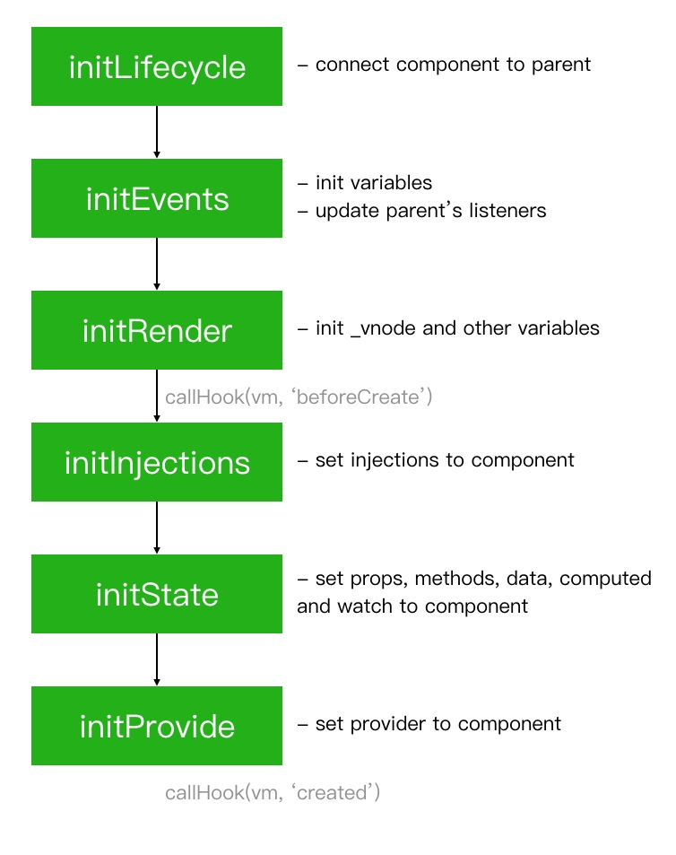

# Init - Introduction

This article belongs to the series [Read Vue Source Code](https://github.com/numbbbbb/read-vue-source-code).

In this article, we will learn:

- What those mixins do
- Understand the init process
- what  happened when you do `const app = new Vue(options);`

#### `options` 到底包含哪些属性？

见 [Vue 2.x Docs](https://v2.vuejs.org/v2/api/#Options-Data)。

#### `new Vue(options)` 返回的 `Vue` 实例是什么？含义是？ 

返回的实例就是一个「组件 component」，它对应页面上某一个组件。

CSS 的视角中，HTML 页面上由一个个「盒子」组成；而 Vue.js 视角中，HTML 页面由一个个「组件」构成。每一个盒子都有内外边距+边界+内容区几大区域；每一个组件都由 `Vue` 类定义，并通过 `new Vue(options)` 实例化出组件。

比如，有一个组件定义在文件 `myComponent.vue` 中，文件大致长这样：

```vue
<template>
	<!-- 略 -->
</template>
<script>
	export default {
		props: { /* 略 */},
		data(){
			return { /* 略 */ }
		}
	}
</script>
<style>
	/* 略 */
<style>
```

假设同文件夹的 `myPage.vue` 要引入这个组件，则 `myPage.vue` 的 `<script>` 标签中会写：

```vue
<template>
	<!-- 在模版中引用时，直接把 myComponent 当一个 html 标签一样使用 -->
	<myComponent></myComponent>
</template>
<script>
	import myComponent from './myComponent.vue';

	export default { /* 略，这里是 myPage 的 options */ }
<script>
```

`options` 就是组件 `.vue` 文件中 `export default { /* 我就是 options */ }` 导出的 `Object` 对象，是一些描述组件特性（`data, props` 等，以及 `mount()` 等生命周期钩子）的属性及其值。

`options` 类似于「类的数据成员和成员函数」，更具体的说，这个「类」就是 `Vue` 类，它是页面的组件模版类。用 Vue 框架写的页面的所有组件元素全部以此为模版构建出来。刚开始 `new Vue(options)` 输入的 `options` 即初始化类时输入的初始参数。

## What those mixins do

We are inside `src/core/instance/index.js` now.

补：这个文件是 `Vue` 声明所在的文件。

```javascript
import { initMixin } from './init'
import { stateMixin } from './state'
import { renderMixin } from './render'
import { eventsMixin } from './events'
import { lifecycleMixin } from './lifecycle'
import { warn } from '../util/index'

// Vue 的声明
function Vue (options) {
	// 检测 Vue 是否通过 new 关键字调用
	// 不是则抛出警告
  if (process.env.NODE_ENV !== 'production' &&
    !(this instanceof Vue)
  ) {
    warn('Vue is a constructor and should be called with the `new` keyword')
  }
  // 初始化
  // options 为 const app = new Vue({...}) 时输入的参数
  // this._init 为 initMixin(Vue) 时创建的 Vue 原型上的成员函数
  this._init(options)
}

// 这些函数在这里被调用，并传入 Vue 作为参数
// Q: 这个文件什么时候被执行？被谁执行？A: 在 import Vue 时就执行，即在 new Vue() 之前就已经执行
initMixin(Vue)
stateMixin(Vue)
eventsMixin(Vue)
lifecycleMixin(Vue)
renderMixin(Vue)

export default Vue
```

#### `!(this instanceof Vue)` 的含义是什么？
 
我们可以从 if 的代码块中打印的警告获得提示：Vue 是一个构造函数，应当通过 new 关键字调用。 
这个警告告诉我们，`Vue()` 应当且只应当用 `new Vue()` 的方式调用。
问题来了：为什么 `!(this instanceof Vue)`  可以用于判断其调用方式呢？
 
从 new 关键字的作用过程说起：
1.  创建一个空的简单 JavaScript 对象（即 **`{}`**）；
2.  为步骤 1 新创建的对象添加属性 **`__proto__`**，将该属性链接至构造函数的原型对象；
3.  将步骤 1 新创建的对象作为 **`this`** 的上下文；
4.  如果该函数没有返回对象，则返回 **`this`**。
 
 ```js
 function simulateNew(Vue){
 	let newObj = {};
 	// 下句代码把 newObj 的原型设置为 Vue.prototype，即 newObj instanceof Vue == true
 	newObj.__proto__ = Vue.prototype;
 	// 下句代码将会把 Vue 函数内部的 this 绑定为刚刚创建的 newObj
 	// 因此，用 new 调用 Vue 构造函数时，Vue 内部的 this 将会等于 newObj，即 this instanceof Vue == true
 	return Vue.call(newObj, ...arguments);
 }
 ```

#### 另一个疑惑，为什么在 Vue 的声明之后调用这几个函数？这些函数什么时候会执行？
 
简答：在 `import Vue from 'core/index'` 时就会执行。注意，不是在 `new Vue()` 时执行，而是在 `import` 语句执行时，被引入的文件 `core/index` 就会整体被执行。
 
更详细的答案在：[[Node-import-引入语句做了什么]]

First, we will walk through those five mixins, find out what they do. Then we go into the `_init` function and see what happens when you execute `var app = new Vue({...})`.

> 注意：以下的 `vm.$xx` 都是 `Vue` **实例**的属性或函数，要与加在 `Vue.prototype` 上的属性或函数（e.g. `Vue.prototype._init`）区分开。`Vue` 实例的属性或函数不与其他 `Vue` 实例共享。

### initMixin

`initMixin` 给 `Vue` 的原型（`Vue.prototype`，相当于加在类上，即每一个实例上）加了一个成员函数 `_init()`。
`_init()` 会初始化 vue 实例的 `$options` 等等。

Open `./init.js`, scroll to the bottom and read definitions.

> 忘了 `mark()` 是干嘛的就看：[[01-find-the-entry#mark & measure]]

```js
let uid = 0;

export function initMixin(Vue: Class<Component>) {
	// initMixin 给 Vue 的原型加了一个成员函数 _init()
	Vue.prototype._init = function (options?: Object) {
		const vm: Component = this;
		// a uid
		vm._uid = uid++;

		let startTag, endTag;
		/* istanbul ignore if */
		if (process.env.NODE_ENV !== 'production' && config.performance && mark) {
			startTag = `vue-perf-init:${vm._uid}`;
			endTag = `vue-perf-end:${vm._uid}`;
			mark(startTag); // 记录 init 开始时间戳
		}

		// a flag to avoid this being observed
		vm._isVue = true; // ? 【 #fixme 这个属性干啥的，啥叫避免被 observed】
		// merge options 合并 options
		// 噢！把 this._init(options) 输入的新的 options 与原本 Vue 已经有的旧的 options 合并
		if (options && options._isComponent) {
		// 优化内部组件的实例化过程？
		// 因为动态 options 合并很慢，所以使用 initInternalComponent 用于优化合并过程？ 
		// 【 #fixme 什么叫动态 options 合并】
			// optimize internal component instantiation
			// since dynamic options merging is pretty slow, and none of the
			// internal component options needs special treatment.
			initInternalComponent(vm, options);
		} else {
			vm.$options = mergeOptions(
				resolveConstructorOptions(vm.constructor),
				options || {},
				vm
			);
		}
		/* istanbul ignore else */
		if (process.env.NODE_ENV !== 'production') {
			initProxy(vm);
		} else {
			vm._renderProxy = vm;
		}
		// expose real self
		vm._self = vm;
		initLifecycle(vm);
		initEvents(vm);
		initRender(vm);
		callHook(vm, 'beforeCreate');
		initInjections(vm); // resolve injections before data/props
		initState(vm);
		initProvide(vm); // resolve provide after data/props
		callHook(vm, 'created');

		/* istanbul ignore if */
		if (process.env.NODE_ENV !== 'production' && config.performance && mark) {
			vm._name = formatComponentName(vm, false);
			mark(endTag);
			measure(`${vm._name} init`, startTag, endTag);
		}

		if (vm.$options.el) {
			vm.$mount(vm.$options.el);
		}
	};
}
```

This file defines:

- function `initMixin()`, it defines `Vue.prototype._init`, we will come back at next section
- function `initInternalComponent()`, its comments implies that this function can speed up internal component instantiation because dynamic options merging is pretty slow

```js
function initInternalComponent(
	vm: Component,
	options: InternalComponentOptions
) {
	// 首先是用 Object.create 克隆了 vm.constructor（就是 Vue()）
	// 【 #fixme vm.constructor.options 是啥？vm.constructor 不是构造函数吗？它哪里来的 options？】
	// opts 是 vm.$options 的指针，也就是说，下面更改 opts 就是更改 vm.$options
	const opts = (vm.$options = Object.create(vm.constructor.options));
	// doing this because it's faster than dynamic enumeration.
	// 【 #fixme dynamic enumeration 难道是说 for (let prop in opts)？是说直接一个一个写比用 for 循环枚举更快？】
	opts.parent = options.parent;
	opts.propsData = options.propsData;
	opts._parentVnode = options._parentVnode;
	opts._parentListeners = options._parentListeners;
	opts._renderChildren = options._renderChildren;
	opts._componentTag = options._componentTag;
	opts._parentElm = options._parentElm;
	opts._refElm = options._refElm;
	if (options.render) {
		opts.render = options.render;
		opts.staticRenderFns = options.staticRenderFns;
	}
}
```

- function `resolveConstructorOptions()`, it collects options
- function `resolveModifiedOptions()`, this is related to [a bug](https://github.com/vuejs/vue/issues/4976). In short, it can let you modify or attach options during hot-reload
- function `dedupe()`, used by `resolveModifiedOptions` to ensure lifecycle hooks won't be duplicated

### stateMixin

下两张图截自 vue 的官方 api 文档目录，即本小节 `stateMixin` 负责初始化的实例属性和方法：

![[vue-src-03-02.png | 150]]
![[vue-src-03-00.png| 200]]

`stateMixin` 给 Vue 的原型加了很多私有变量的拦截器（就是加了 setter 和 getter，防止用户直接接触到私有变量，套一层保护壳保护私有变量 `this._data` 和 `this._props` ）和触发双向绑定的工具函数（官方api 中的 [Global API](https://v2.vuejs.org/v2/api/?#Global-API)），主要是 `$data, $props, $watch, $set, $delete`。

前三者都是写 vue 模版代码时最常见的那几个：

```js
props: ['initialCounter'],
data: function () {
	return {
		counter: this.initialCounter
	}
},
watch:{
	// whenever counter changes, this function will run
	counter: function(newVal, oldVal){}
}
```

`$watch`、`$set` 和 `$delete` 是在写代码时手动触发视图改变利用的函数工具。比如点击某个按钮后删除对象的某个属性，这个变化需要同步体现在页面上，我们就可以在按钮的 handler 函数中用 `vm.$delete` 删除目标属性，确保触发页面变化。如果直接用 `del obj[prop]`，就无法让页面捕捉到相应对象的属性变化。

`$set` 同理，如果直接用 `obj[prop]=newVal`，页面无法捕捉到数据变化，必须使用工具函数 `vm.$set() / Vue.set()`，用于添加新属性并触发数据视图双向绑定。给 vue 的对象动态添加新属性时，务必使用 `vm.$set`，否则无法触发视图改变。

与双向绑定有关的函数不在当前 `state.js` ，而在 `src/core/observer/index.js` 中，`state.js` 通过 `import` 引入。

[官方 api: Vue-set](https://v2.vuejs.org/v2/api/?#Vue-set)

Adds a property to a reactive object, ensuring the new property is also reactive, so triggers view updates. This must be used to add new properties to reactive objects, as Vue cannot detect normal property additions (e.g. this.myObject.newProperty = 'hi').
The target object cannot be a Vue instance, or the root data object of a Vue instance.

Open `./state,js`, this is a long file, search `statemixin`.

```javascript
export function stateMixin (Vue: Class<Component>) {
  // flow somehow has problems with directly declared definition object
  // when using Object.defineProperty, so we have to procedurally build up
  // the object here.
  /**
  * 设置 $data 和 $props
  */
  const dataDef = {}
  dataDef.get = function () { return this._data }
  const propsDef = {}
  propsDef.get = function () { return this._props }
  if (process.env.NODE_ENV !== 'production') {
	// 用户设置 $data 时，在非生产环境抛出警告并拒绝设置操作
    dataDef.set = function (newData: Object) {
    // #fixme 什么叫 nested data properties
      warn(
        'Avoid replacing instance root $data. ' +
        'Use nested data properties instead.',
        this
      )
    }
    // 拒绝用户设置 $props
    propsDef.set = function () {
      warn(`$props is readonly.`, this)
    }
  }
  /**
  * vue 的源码设置 defineProperty 的方式是，先把输入参数设置好，然后再统一 define，而不是直接 Object.defineProperty(obj, 'xx', {
  * get: function(){}, set: function(){}
  * })
  * 看最前面的注释，似乎是因为某种奇妙的 problem，但没点明
  */
  Object.defineProperty(Vue.prototype, '$data', dataDef)
  Object.defineProperty(Vue.prototype, '$props', propsDef)

  Vue.prototype.$set = set // 其他文件 import 来的
  Vue.prototype.$delete = del // 其他文件 import 来的

  Vue.prototype.$watch = function (
    expOrFn: string | Function,
    cb: Function,
    options?: Object
  ): Function {
    const vm: Component = this
    options = options || {}
    options.user = true
    const watcher = new Watcher(vm, expOrFn, cb, options)
    if (options.immediate) {
      cb.call(vm, watcher.value)
    }
    return function unwatchFn () {
      watcher.teardown()
    }
  }
}
```

This function defines:

- `dataDef` and it's getter
- `propsDef` and it's getter
- setters for `dataDef` and `propsDef` if not built for production, which just log two warnings

`$data` 和 `$props` 的 getter 只是直接 `return` 了它们各自的值；
setter 主要就是在非生产环境抛出不能直接更改 vue 根实例属性的警告（避免用户 `vm.$data = {...}` ⬅️这样修改根实例的属性）。

- `dataDef` to `Vue.prototype` as `$data`
- `propsDef` to `Vue.prototype` as `$props`
- `Vue.prototype.$set` and `Vue.prototype.$delete`
- `Vue.prototype.$watch`

Sounds familiar? Yes, here we get `$data`, `$props`, `$set`, `$delete` and `$watch`. Read this file carefully, you can learn some coding skills and use them in your own projects.

Have you noticed the `Watcher`? Seems like an important class! You are right, in later articles we will explain `Observer`, `Dep` and `Watcher`. They cooperate to implement data and view synchronization.【数据-视图双向绑定】

### eventsMixin

> 定义了四个与事件和事件监听器有关的工具函数，`$on, $emit, $once, $off`。

下图截取自 vue 官方 api 文档目录：

![[vue-src-03-01.png | 200]]

Open `./events.js` and search `eventsMixin`, it's too long to put the screenshot here, so read it by yourself.

This function defines:

- `Vue.prototype.$on`
- `Vue.prototype.$emit`

[设置/触发用户自定义事件](https://v2.vuejs.org/v2/api/?#vm-on)，通常用于父子组件的信息传递。

```js
// 设置自定义事件 test
vm.$on('test', msg =console.log(msg))
// 在另一个地方触发自定义事件 test
vm.$emit('test', 'hello') // hello
```

- `Vue.prototype.$once`

> [一次性监听器](https://v2.vuejs.org/v2/api/?#vm-once)：Listen for a custom event, but only once. The listener will be removed once it triggers for the first time.

```js
 Vue.prototype.$once = function (event: string, fn: Function): Component {
    const vm: Component = this
    function on () {
      vm.$off(event, on) // 先删掉 vm._events[event] 的 handler on
      fn.apply(vm, arguments) // 执行事件监听器 handler vm.fn(arguments)
      // 自由变量 fn 的查找从函数定义的地方开始
    }
    on.fn = fn // 这句代码有啥用？见 $off 的源码
    // 上面这句代码保证了，既可以因为事件触发，执行函数 on() 通过 vm.$off(event, on) 来清除监听器；也可以在事件触发前，手动通过 vm.$off(event, fn) 来清除监听器
    // 如果不加入这个代码，就没有一种方法能够让开发者手动清除 event 的监听器 fn 了，因为实际上 vm._events[event] 注册的监听器 handler 是函数 on()，而 on 被封装在 $once 中，开发者无法获取
    // 所以需要提供额外的接口（cb.fn==fn）来清除 event 的监听器 fn
    vm.$on(event, on) // 注意，这里加入事件 event 的 handler 数组的函数是 on 而不是 fn
    return vm
  }
```

- `Vue.prototype.$off`

> [关闭自定义事件监听器](https://v2.vuejs.org/v2/api/?#vm-off)：
> -   If no arguments are provided, remove all event listeners;
> -   If only the event is provided, remove all listeners for that event; 
> -   If both event and callback are given, remove the listener for that specific callback only.

off 有三种方式清除监听器：1）清除所有事件的所有监听器；2）清除某个事件的所有监听器；3）清除某个事件的某个监听器。

以上 `on.fn = fn` 就是在第三种方式上起作用：

```js
const cbs = vm._events[event] // 获得事件 event 的监听器们
// specific handler
let cb
let i = cbs.length
while (i--) { // 倒序遍历监听器
  cb = cbs[i]
  // 以下两种判断方式对应两种清除 handler 的方式
  // 前者是普通的清除方式；后者专为触发前（调用事件 event 前）清除用 $once 注册的一次性事件监听器
  if (cb === fn || cb.fn === fn) {
	cbs.splice(i, 1) // 清除
	break
  }
}
```

vue 清空某一个对象的方式不是直接赋值 `null`，而是：

`vm._events = Object.create(null);`

又出现了，以 `null` 为原型的对象：[null-prototype object](https://developer.mozilla.org/en-US/docs/Web/JavaScript/Reference/Global_Objects/Object#null-prototype_objects)。为什么使用这个？

> In practice, objects with `null` prototype are usually used as a cheap substitute for [maps](https://developer.mozilla.org/en-US/docs/Web/JavaScript/Reference/Global_Objects/Map).

也许就是为了防止 `Object.prototype` 上众多的原型成员函数们（比如 `toString(), hasOwnProperty()` 等）污染事件对象。

`Object.create(null)` 是 truly 变量：

```js
let nullObject = Object.create(null);
if (nullObject) {
	console.log('null object is truly.'); // 会打印到控制台
}
```

You must have used them for many times, just read the code and learn how to implement event manipulation elegantly.

这个代码学到了：

`vm._events` 是否存在属性叫 `event`，不存在则赋值为空数组并且 push：
`(vm._events[event] || (vm._events[event] = [])).push(fn);`

顺带一提，原来同一个事件可以绑定多个监听器函数。看 `$emit` 的代码实现也会发现，事件绑定的每一个函数都会执行一次。

又学到一个写 for 循环的小 trick：

`for (let i = 0, l = nums.length; i < l; i++)`

直接在括号里获得数组的长度 `l`。

生命周期的 `hook:event` 似乎是特地为生命周期钩子函数留的口：

```js
const hookRE = /^hook:/
// optimize hook:event cost by using a boolean flag marked at registration
// instead of a hash lookup
if (hookRE.test(event)) {
	vm._hasHookEvent = true
}
```

再顺便一提，自定义事件的命名建议使用短横杠的 `event-name` 而不建议驼峰命名 `eventName`。因为 HTML 不区分大小写。`$emit` 会自动把事件名称转换为小写后再查找。

### lifecycleMixin

Open `lifecycle.js`, scroll down to find `lifecycleMixin`.

下图依然截取自官方 api 文档目录：
![[vue-src-03-03.png | 200]]

This function defines:

- `Vue.prototype._update()`, DOM updating happens here! Will be covered in later articles
- `Vue.prototype.$forceUpdate()`
- `Vue.prototype.$destroy()`

Hey, what's that below `$destroy`? `mountComponent`! We have seen it before, it's the core of `$mount` and is wrapped twice.

Keep going, we get several functions about the component. They are used in DOM updating, just ignore them now.

### renderMixin

Open `./render.js`, it defines `Vue.prototype._render()` and some helpers【比如 `Vue.prototype.$nextTick`. They will also appear in later articles, just keep in mind that we meet `_render` here.

---

Okay, so now we understand what those mixins do, they just set some functions to `Vue.prototype`.

![[vue-src-03-04.png]]

The important thing here is how to divide and organize a bunch of functions. How many parts would you make if you are the author? Which part should one function go? Think from the point of author's view, it's very interesting and helpful.

## Understand the init process

After looking the static parts, now we go back to the core.

```javascript
function Vue (options) {
  if (process.env.NODE_ENV !== 'production' &&
    !(this instanceof Vue)
  ) {
    warn('Vue is a constructor and should be called with the `new` keyword')
  }
  this._init(options)
}
```

Here we have a small demo from Vue's official document:

```javascript
var app = new Vue({
  el: '#app',
  data: {
    message: 'Hello Vue!'
  }
})
```

Now load them to your mind and let's begin the execution.

First, we call `new Vue({...})`, which means:

```javascript
options = {
  el: '#app',
  data: {
    message: 'Hello Vue!'
  }
}
```

Then `this._init(options)`. Remember where `_init()` is defined? Yes, in `./init.js`, open it and read the function codes.

`_init()` do:

- set `_uid`
- mark performance start tag 
- set `_isVue`
- set options
- set `_renderProxy`. Proxy is used during development to show you more render information
- set `_self`
- call a bunch of init functions
- mark performance end tag
- call `$mount()` to update DOM

Now we focus on those init functions.

```javascript
initLifecycle(vm)
initEvents(vm)
initRender(vm)
callHook(vm, 'beforeCreate')
initInjections(vm) // resolve injections before data/props
initState(vm)
initProvide(vm) // resolve provide after data/props
callHook(vm, 'created')
```

`callHook()` is easy to understand, it just calls your hook functions. Next, we will explain the other six init functions in detail.

`callHook()` 在 `src/core/instance/lifecycle.js`：

```js
export function callHook (vm: Component, hook: string) {
// 对应生命周期 hook 的函数在 vm.$options 里
  const handlers = vm.$options[hook]
  // 如果有函数，则执行
  // #fixme 为什么生命周期函数是一个数组？
  if (handlers) {
    for (let i = 0, j = handlers.length; i < j; i++) {
      try {
        handlers[i].call(vm)
      } catch (e) {
        handleError(e, vm, `${hook} hook`)
      }
    }
  }
  // #fixme 下面这个 hookEvent 是在哪里声明的？
  if (vm._hasHookEvent) {
    vm.$emit('hook:' + hook)
  }
}
```

`vm.$option` 对应的生命周期钩子们（摘录自[Vue api 指南](https://v2.vuejs.org/v2/api/#Options-Lifecycle-Hooks)）：

![[vue-src-03-05.png | 240]]

以上全部对应一个函数。

在 vue 的指南中发现这个 tip，不能用箭头函数作为生命周期钩子函数：

> All lifecycle hooks automatically have their `this` context bound to the instance, so that you can access data, computed properties, and methods. This means **you should not use an arrow function to define a lifecycle method** (e.g. `created: () => this.fetchTodos()`). The reason is arrow functions bind the parent context, so `this` will not be the Vue instance as you expect and `this.fetchTodos` will be undefined.

解释在（coding 库中）：[[22-12-30-js-this-箭头函数-call-apply-bind]]。

### initLifecycle

It's located in `./lifecycle`. 

This function connects this component with its parent, initializes some variables used in lifecycle methods.

这个函数把当前实例 `vm` 与它的所有上一级元素都链接起来（把当前实例加入到所有上一级元素的 `$children` 数组中 `parent.$options.$children.push(vm)`），并且把 `vm` 的父元素设置为最高级父元素（在父子链中备份最高的，比如 a1->a2->a3，a3 的 `$parent` 会被设置为 a1，而不是离得最近的 a2）。

并且，把 `vm` 的 `$root` 设置为 `$parent.$root`；如果没有父元素，则设置为 `vm` 自身。

一些与生命周期有关的变量初始化：

```js
vm._watcher = null
vm._inactive = null
vm._directInactive = false
vm._isMounted = false
vm._isDestroyed = false
vm._isBeingDestroyed = false
```

### initEvents

It's located in `./events.js`.

```js
export function initEvents (vm: Component) {
  vm._events = Object.create(null)
  vm._hasHookEvent = false
  // init parent attached events
  const listeners = vm.$options._parentListeners
  if (listeners) {
    updateComponentListeners(vm, listeners)
  }
}
```

比较短。初始化与事件相关的变量，并且把当前实例的监听器初始化为父元素的监听器。

This function initializes variables and updates them with its parent's listeners.

### initRender

It's located in `./render.js`.

```js
export function initRender (vm: Component) {
  vm._vnode = null // the root of the child tree
  vm._staticTrees = null
  const parentVnode = vm.$vnode = vm.$options._parentVnode // the placeholder node in parent tree
  const renderContext = parentVnode && parentVnode.context
  vm.$slots = resolveSlots(vm.$options._renderChildren, renderContext)
  vm.$scopedSlots = emptyObject
  // bind the createElement fn to this instance
  // so that we get proper render context inside it.
  // args order: tag, data, children, normalizationType, alwaysNormalize
  // internal version is used by render functions compiled from templates
  vm._c = (a, b, c, d) => createElement(vm, a, b, c, d, false)
  // normalization is always applied for the public version, used in
  // user-written render functions.
  vm.$createElement = (a, b, c, d) => createElement(vm, a, b, c, d, true)
}
```

This function initializes `_vnode`, `_staticTrees` and some other variables and methods.

#### 回忆 slot 的用法

出现了 `$slot`。回忆一下 slot 的用法：

首先，在一个文件中使用组件 `<my-component>`

```vue
<my-component>
我会出现在插槽 slot 中
</my-component>
```

组件 `<my-component>` 的代码 my-component.vue：

```vue
<template>
	<p>
		<!-- 我会出现在插槽 slot 中 -->
		<slot></slot>
	</p>
</template>
```

简单说就是，被插入组件的开始标签和结束标签中间的值（`我会出现在插槽 slot 中`）会传递给组件中写有 `<slot></slot>` 的地方。`<slot>` 就类似一个 placeholder。

Here we meet VNode for the first time. 

What is VNode? It's used to build the VDom. VNode and VDom correspond to real Node and DOM. The reason Vue chose these two representations is performance. 

When your data changes, Vue needs to update the webpage. The simplest way is refreshing the whole page. But it costs a lot of browser resources and much of them are just wasted. Normally you just update a few properties, why not just update the parts that change? Thus Vue adds a layer of VNode and VDom between data and view, implements an algorithm to calculate the best DOM manipulation strategy and apply that to the DOM.

We will talk about render and update later.

### initInjections

It's located in `./inject.js`.

This function is short and simple, it just resolves the injections in options and set them to your component.

But wait, what's that, is it `defineProperty`? No, it's `defineReactive`. The word `reactive` must remind you of something, Vue can update view automatically while data change, maybe we can find something related to that inside this function, let's go.

#### defineReactive

Open `../observer/index.js` and search `defineReactive`.

This function first defines `const dep = new Dep()`, does some validation, then extracts the getter and setter.

```javascript
let childOb = observe(val) // <-- IMPORTANT
Object.defineProperty(obj, key, {
  enumerable: true,
  configurable: true,
  get: function reactiveGetter () {
    const value = getter ? getter.call(obj) : val
    if (Dep.target) {
      dep.depend() // <-- IMPORTANT
      if (childOb) {
        childOb.dep.depend() // <-- IMPORTANT
      }
      if (Array.isArray(value)) {
        dependArray(value)
      }
    }
    return value
  },
  set: function reactiveSetter (newVal) {
    const value = getter ? getter.call(obj) : val
    /* eslint-disable no-self-compare */
    if (newVal === value || (newVal !== newVal && value !== value)) {
      return
    }
    /* eslint-enable no-self-compare */
    if (process.env.NODE_ENV !== 'production' && customSetter) {
      customSetter()
    }
    if (setter) {
      setter.call(obj, newVal)
    } else {
      val = newVal
    }
    childOb = observe(newVal) // <-- IMPORTANT
    dep.notify() // <-- IMPORTANT
  }
})
```

Next it defines `childOb = observe(val)`, set a new property to our component.

I have marked the key parts in comment. Even if you haven't read the related code, you can tell how Vue do view updating while data changes. It just wraps value with getter and setter inside which it constructs dependency and sends notify.

This `defineReactive` function is used in many places, not only in initInjections, we will talk about `Observer`, `Dep` and `Watcher` in later articles, just go back to our initialization and go on.

### initState

It's located in `./state.js`.

```javascript
export function initState (vm: Component) {
  vm._watchers = []
  const opts = vm.$options
  if (opts.props) initProps(vm, opts.props)
  if (opts.methods) initMethods(vm, opts.methods)
  if (opts.data) {
    initData(vm)
  } else {
    observe(vm._data = {}, true /* asRootData */)
  }
  if (opts.computed) initComputed(vm, opts.computed)
  if (opts.watch) initWatch(vm, opts.watch)
}
```

Old friends again. Here we get our props, methods, data, computed properties and watch functions. Let's check them one by one.

定义一些熟悉的 Vue 实例属性：

```js
var vm = new Vue({
	data: function() {},
	props: [],
	methods: {},
	computed: {},
	watch: {}
})
```

#### initProps

Do some validations and use `defineReactive` to wrap props and set them to the component.

#### initMethods

Just set methods to the component.

#### initData

More validations, but here it uses `proxy` to set data, search `proxy` and read it, you know it will proxy operations like `this.name` to `this._data['name']`. 

At the end, this function calls `observe(data, true) /* asRootData */`. We will talk about Observer in later articles, here I just want to explain that `true`. Each observed object has a property called `vmCount` which means how many components use this object as root data. If you call `observe` with `true`, it will call `vmCount++`. The default value of `vmCount` is `0`.

Maybe this property will be used in other process, but after a global search, I just find Vue uses it as a sign for root data. If `ob && ob.vmCount`, this object must be a root data.

#### initComputed

This function first extracts the function you put in as a getter, then creates a Watcher with it and store in `watchers` array. Finally, it calls `defineComputed` to set this computed property to the component.

You can guess what the name Watcher means, but we will leave it to later articles.

#### initWatch

This function creates watcher for each input uses `createWatcher()`. `createWatcher()` calls `vm.$watch()` which is defined in `stateMixin`. Scroll to the end to see it. `vm.$watch()` will create Watcher and...What?! It may call `createWatcher()` again! What the hell is it doing?

Read it carefully, if `cb` is plain object, `$watch()` will call `createWatcher()`. And inside `createWatcher()`, it will extract options and handler if the handler(in `$watch()` it's named `cb`) is plain object. Alright, `$watch()` just through it back because he doesn't want to do extra jobs.

### initProvider

It's located also in `./inject.js`.

This function extracts providers in options and calls them on the component.

Have you noticed the comments after `initInjections` and `initProvider`? It says:

```javascript
initInjections(vm) // resolve injections before data/props
initState(vm)
initProvide(vm) // resolve provide after data/props
```

Why do they have this order? I'll let you answer this.

---

That's all. Hard to remember all inits? I made a picture for you:



This article is a little long and contains many details. Init process is the basement of later articles, so make sure you have understood all contents.

I'm not intend to tell you everything, so I suggest you read the whole init process again and go into the implementation of unfamiliar functions to see how they work.

## Next Step

This article shows the whole initialization process. After initialization, data can be modified, views will also sync with data. How does Vue implement the data updating process? Next article will reveal it.

Read next chapter: [Dynamic Data - Observer, Dep and Watcher](https://github.com/numbbbbb/read-vue-source-code/blob/master/04-dynamic-data-observer-dep-and-watcher.md).

## Practice

```javascript
initInjections(vm) // resolve injections before data/props
initState(vm)
initProvide(vm) // resolve provide after data/props
```

Why do they have this order? I'll let you answer this.

Hint: think from another side, what will happen if you change their order?

